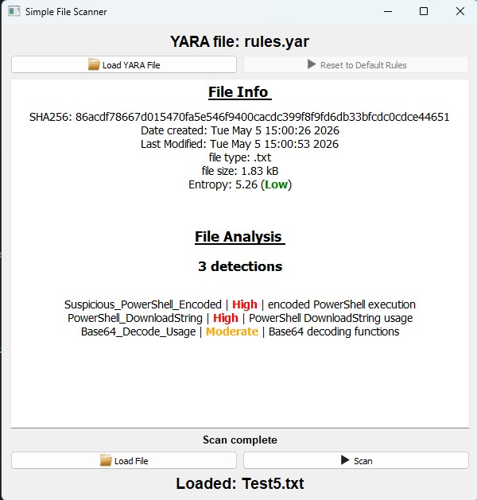

# File Analyzer

A lightweight easy to use Python-based file analysis tool that uses **YARA rules** to detect suspicious or potentially malicious files.

---

## Features

- Load custom YARA rule files
- Scan files against YARA signatures
- Severity-based detection results
- SHA256 hash generation
- File metadata display
- Simple and clean graphical interface
  
---

## Demo Screenshot

> Replace this image with your own screenshot



---

## Example Detection Output

```text
Suspicious_PowerShell_Encoded | High | encoded PowerShell execution
PowerShell_DownloadString | High | PowerShell DownloadString usage
WMI_Process_Creation | High | WMI-based process creation
```

---

## Requirements

- Python 3.x
- yara-python
- PyQt5

Install dependencies:

```bash
pip install yara-python pandas
```

---

### Workflow

1. Load a YARA rules file
2. Select a file to scan
3. Press **Scan**
4. Review detection results and file information

## Disclaimer

This tool is intended for educational and research purposes only.
